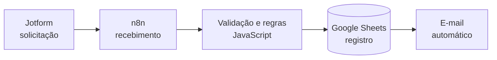

# Henrique Baptista Viganó

### Dados · Automação · Business Intelligence · Inteligência Artificial

Transformo processos manuais em soluções digitais: integro sistemas, organizo dados e automatizo o que é repetitivo para que as equipes foquem no que gera valor.

[Sobre mim](#sobre-mim) • [Projetos](#projetos-em-destaque) • [Tecnologias](#tecnologias) • [Formação](#formação) • [Contato](#contato)

---

## Sobre mim

Sou formado em **Análise e Desenvolvimento de Sistemas** pela USCS e curso pós-graduação em **Machine Learning Engineering** na **FIAP**.

Atuo em Tecnologia da Informação como responsável pelas automações da empresa, desenvolvendo fluxos automatizados, formulários web, dashboards e integrações entre sistemas que reduzem trabalho manual e padronizam processos.

**No que eu trabalho:**

- ⚙️ **Automação de processos** — fluxos com n8n e Power Automate, integrações via API e aplicação de regras de negócio
- 📊 **Dados e BI** — dashboards em Power BI, análises com Excel e SQL, modelagem de dados
- 🔗 **Integração de sistemas** — Odoo, Salesforce e CRMs conectados a formulários, planilhas e e-mail
- 🤖 **IA aplicada** — LLMs, chatbots e automações com inteligência artificial

---

## Projetos em destaque

### 🛒 Cadastro de Produtos para Odoo

> Aplicação web que padroniza as informações usadas no cadastro de produtos no Odoo.

**Problema:** o cadastro manual gerava inconsistências no preenchimento e dificultava a classificação dos itens.

**Solução:** uma interface com campos dinâmicos e validações que guia o preenchimento e classifica cada produto automaticamente.

- Classificação automática por linha de negócio (LOB)
- Definição de origem, categoria e tipo do produto
- Regras específicas para notebooks, desktops, monitores, peças, serviços e softwares
- Dados estruturados e prontos para importação no Odoo
- Interface responsiva e personalizada

<!-- Se tiver um número de resultado, adicione aqui. Ex.: **Resultado:** redução de X% nos erros de cadastro. -->

<!-- [🔗 Ver repositório](LINK) · [▶️ Demonstração](LINK) -->

---

### 📝 Automação de Registros de Oportunidade (RO)

> Fluxo que automatiza o recebimento, tratamento, registro e encaminhamento de oportunidades comerciais.

**Problema:** as solicitações de registro de oportunidade eram tratadas manualmente, com retrabalho e falta de padronização.

**Solução:** um fluxo de ponta a ponta que recebe o formulário, aplica as regras de negócio, registra os dados e dispara os e-mails automaticamente.

- Recebimento automático das solicitações enviadas pelo formulário
- Tratamento e validação dos dados
- Processamento de múltiplos produtos em uma mesma solicitação
- Registro estruturado em planilha
- Geração e envio automático de e-mails

<!-- Se tiver um número de resultado, adicione aqui. Ex.: **Resultado:** X horas economizadas por mês / Y solicitações processadas. -->

---

## Tecnologias

**Automação e integrações**

**Dados e BI**

**Desenvolvimento**

**Sistemas e plataformas**

**Inteligência Artificial**

---

## Formação

| Instituição | Curso | Situação |
|---|---|---|
| **FIAP** | Pós-graduação em Machine Learning Engineering | 🟡 Em andamento |
| **USCS** | Tecnologia em Análise e Desenvolvimento de Sistemas | ✅ Concluído |

---

## Contato

Busco evoluir nas áreas de **Automação, Dados, Business Intelligence e Inteligência Artificial**, criando soluções que integrem sistemas, organizem informações e gerem valor para o negócio.

Estou aberto a oportunidades e projetos nessas áreas. Fique à vontade para entrar em contato pelo [LinkedIn](https://www.linkedin.com/in/SEU-USUARIO) ou por [e-mail](mailto:SEU-EMAIL).

**Automatizar · Analisar · Evoluir**

